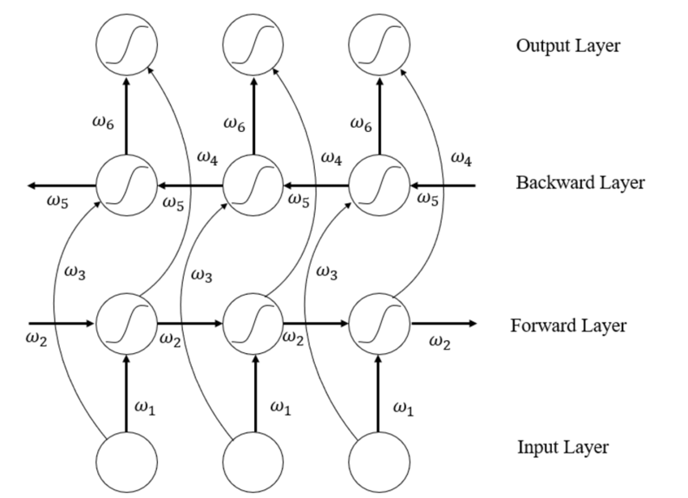
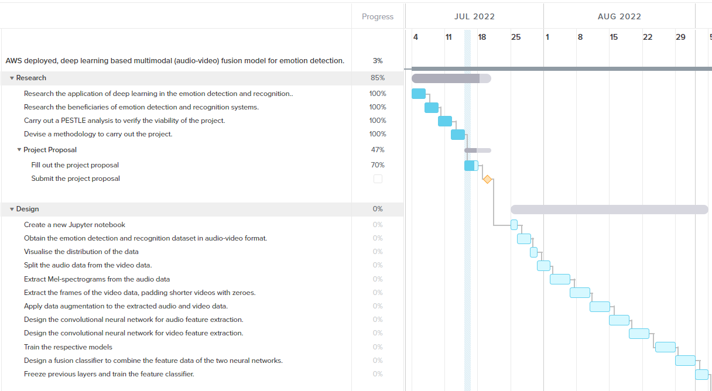
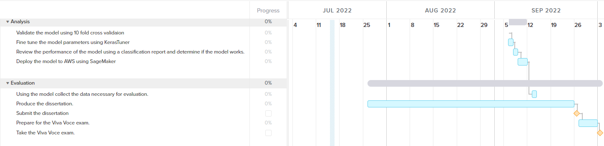

# 🧠 Multimodal Emotion Detection using Deep Learning
**Master of Science in Artificial Intelligence Dissertation | 2023/2024**

---

## 📌 Project Overview
This research explores the development of a novel multimodal ensemble model designed to integrate both **audio and video data** for robust emotion detection. The project addresses critical challenges in Human-Computer Interaction (HCI), such as cultural bias and the limitations of single-modality data diversity.

## 🏗️ Technical Architecture
The proposed model uses a **Transfer Learning Ensemble** approach to capture complex emotional cues:

* **MobileNet Base**: A pre-trained CNN used as an ultra-lightweight feature extractor, ideal for high-efficiency processing.
* **Bidirectional LSTM (BiLSTM)**: Layers designed to capture long-range temporal dependencies in sequential data, identifying how emotions evolve over time.
* **GlobalPooling3D**: Two layers with **ELU activation** utilized for dimensionality reduction to optimize model size.

*Figure: Diagram of the BiLSTM cell structure used to capture temporal dependencies.*

---

## 🛠️ Data Engineering & Preprocessing
The model was designed for the **RAVDESS dataset**, involving 7,356 files of emotional speech and song.

### Video Pipeline
* **Facial Landmark Detection**: Implemented a **3D Face Mesh** using MediaPipe to extract 468 consistent coordinates per frame.
* **Downscaling & Cropping**: Raw 720p video was downscaled and cropped to a **128x128 bounding box** to focus on facial landmarks and reduce computational load.

### Audio Pipeline
* **Feature Extraction**: Extracted **MFCCs, Chroma, Contrast, and Spectral Centroid** data to capture pitch, timbre, and amplitude variations.
* **Temporal Alignment**: Audio features were synchronized with video frames at 30fps to ensure perfect multimodal alignment.

---

## 🔬 Implementation Challenges & Results
The project served as a **Proof of Concept** to validate state-of-the-art methodology.

* **Hardware Constraints**: Due to local RAM limitations, the full multimodal fusion training was restricted by the massive memory requirements of image sequences.
* **Baseline Success**: An audio-only model was trained to establish a performance floor. The resulting **12% accuracy** highlighted the necessity of multimodal fusion, proving that audio alone is insufficient for robust emotion detection.

---

## 📅 Project Management
The project followed a rigorous 3-month timeline, managed via an **Agile methodology** and tracked using a **Gantt Chart** to ensure all research milestones were met.

### Project Timeline & Milestones
| Phase 1: Research & Design | Phase 2: Analysis & Evaluation |
| :---: | :---: |
|  |  |

---

## 🚀 Future Work
* **Attention Mechanisms**: Integrating additive or self-attention to focus the model on the most relevant emotional cues.
* **Encoder-Based Transformers**: Investigating transformer architectures for individual modality training and better data alignment.
* **CREMA-D Dataset**: Retraining on more demographically diverse data to further mitigate cultural and racial bias.

---
**[📄 View Full Dissertation (Word)](Dissertation.docx)** | **[📊 View Presentation (PPTX)](Presentation.pptx)**
